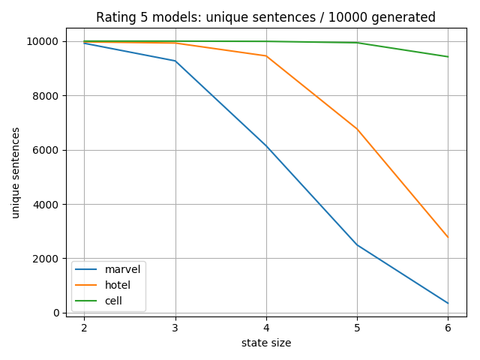

# Project report

### 1 Introduction

### 2 Data
Our model creator and generator currently support a total of three datasets. The marvel dataset consists of reviews of several Marvel movies scraped from [Rotten Tomatoes](https://www.rottentomatoes.com/) using our own webscraper. The hotel dataset is a [modified](https://data.world/jenka13all/lara-hotel-reviews/workspace/file?filename=7282_with_textcat_languagetags.csv) version of [Datafini's](https://data.world/datafiniti/hotel-reviews) hotel review dataset with language tags. The cell dataset is [Julian McAuley's](http://jmcauley.ucsd.edu/data/amazon/) Cell Phones and Accessories -dataset containing Amazon product reviews. The datasets used come with following sentences per rating distributions.

\# sentences| 1 | 2 | 3 | 4 | 5
--- | --- | --- | --- | --- | ---
marvel | 1811 | 5063 | 12634 | 17468 | 10973
hotel | 14529 | 13614 | 22504 | 35053 | 46347
cell | 74276 | 71545 | 134108 | 286311 | 648651

Support for other datasets is can also be implemented with small changes to the code.

### 3 Model creator
To use other models aside from the premade ones already in the repository, for example one with different state size, they have to be manually created using our model creator. The different phases for the pipeline of our model creator are described below.
1. In the 'load and normalize' -phase the dataset designaded by the user is loaded to memory and normalized by dropping unused columns, renaming the columns containing either the review rating or the review text itself and filtering reviews not in English.
1. In the preprocessing phase, only reviews with the rating given by the user are used. Firstly the reviews are lower-cased so that the model treats same words the same way. Then the reviews are processed so that all sentences end with a dot and some of the dots used inside sentences are replaced. Last common non-words such as html-tags are replaced.
1. In the 'to sentences' -phase, the reviews are split to sentences. This is done because the Markov model can only tell us about the relationship of words within sentences.
1. In the 'remove punctuation' -phase, most of the punctuation inside the sentences is removed. This is done so that the generator won't consider lone punctuations as words and won't for example generate a sentence starting with a dash. Only the percent-symbol and stuff like apostrophes and dashes within words are spared. The filtering is done using regex-based character replacement.
1. In the cleaning phase excess whitespaces are removed and useless or empty sentences are removed.
1. In the 'create model' -phase the actual Markov model is created from the sentences given by the previous phase. We use [Markovify](https://github.com/jsvine/markovify) as our Markov chain generator. Markovify allows us to easily create models with different state sizes and is also easily extensible. We chose to extend it with [spaCy's](https://github.com/explosion/spaCy) part-of-speech tagger. This allows us to generate sentences which obey sentence structure better. The following example shows the form in which the sentences are stored to the model.

    ```['it::PRON', 'could::VERB', "n't::ADV", 'be::VERB', 'helped::VERB']```
    
    As we can see the tagger is even able to recognize and seperate the adverb 'not' from base word. 
1. In the last phase the created model is saved to disk in json format. This approach was chosen because the bigger models can take a long time to create, while sentence-generation from a premade model loaded to memory is almost instant. So the user experience provided is quite snappy, but storing all the premade models can take even gigabytes of disk space.

### 4 Generator

### 5 Model statistics

##### 5.1 Unique sentences
The following graph shows the number of unique sentences per 10000 generated sentences for different rating 5 models.


