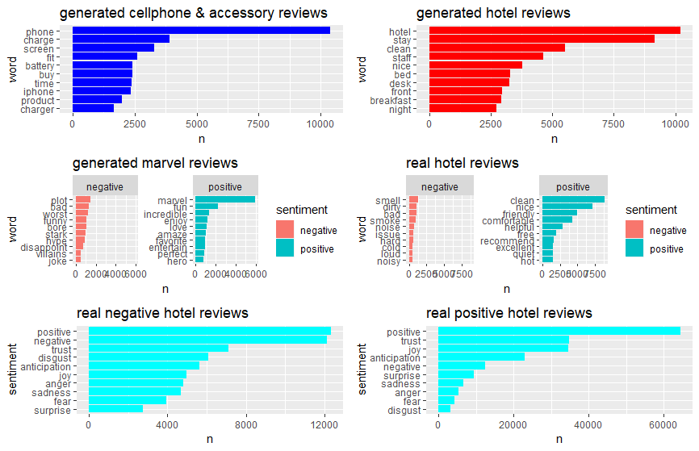
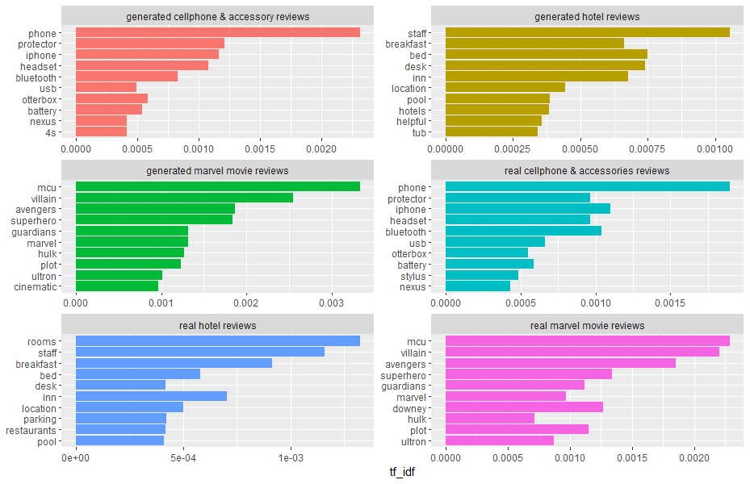

# Project report

## 1 Introduction

## 2 Data gathering

Our model creator and generator currently support a total of three datasets. The marvel dataset was made by web scraping audience reviews from several movies belonging in the Marvel Cinematic Universe from [Rotten Tomatoes](https://www.rottentomatoes.com/). The scraped reviews were 1000 most recent ones visible on the website. The web scraper was coded for the purposes of this project and was created using the BeautifulSoup library for python. Originally we attempted to scrape more reviews from TripAdvisor but that proved to be too difficult after a while of trying to get a web scraper to work on their website. The hotel dataset is a [modified](https://data.world/jenka13all/lara-hotel-reviews/workspace/file?filename=7282_with_textcat_languagetags.csv) version of [Datafiniti's](https://data.world/datafiniti/hotel-reviews) hotel review dataset with language tags. The cell dataset is [Julian McAuley's](http://jmcauley.ucsd.edu/data/amazon/) Cell Phones and Accessories -dataset containing Amazon product reviews. Support for other datasets is can also be implemented with small changes to the code.

The datasets used come with following sentences per rating distributions:

\# sentences| 1 | 2 | 3 | 4 | 5
--- | --- | --- | --- | --- | ---
marvel | 1811 | 5063 | 12634 | 17468 | 10973
hotel | 14529 | 13614 | 22504 | 35053 | 46347
cell | 74276 | 71545 | 134108 | 286311 | 648651

Other data used in the project consists of generated datasets created using the review generator.

## 3 Model creator

To use other models aside from the premade ones already in the repository, for example one with different state size, they have to be manually created using our model creator via the CLI provided. The different phases of the pipeline of our model creator are described below.
1. In the 'load and normalize' -phase the dataset designaded by the user is loaded to memory and normalized by dropping unused columns, renaming the columns containing either the review rating or the review text itself and filtering reviews not in English.
1. In the preprocessing phase, only reviews with the rating given by the user are used. Firstly the reviews are lower-cased so that the model treats same words the same way. Then the reviews are processed so that all sentences end with a dot and some of the dots used inside sentences are replaced. Last common non-words such as html-tags are replaced.
1. In the 'to sentences' -phase, the reviews are split to sentences. This is done because the Markov model can only tell us about the relationship of words within sentences.
1. In the 'remove punctuation' -phase, most of the punctuation inside the sentences is removed. This is done so that the generator won't consider lone punctuations as words and won't for example generate a sentence starting with a dash. Only the percent-symbol and stuff like apostrophes and dashes within words are spared. The filtering is done using regex-based character replacement.
1. In the cleaning phase excess whitespaces are removed and useless or empty sentences are removed.
1. In the 'create model' -phase the actual Markov model is created from the sentences given by the previous phase. We use [Markovify](https://github.com/jsvine/markovify) as our Markov chain generator. Markovify allows us to easily create models with different state sizes and is also easily extensible. We chose to extend it with [spaCy](https://github.com/explosion/spaCy)'s part-of-speech tagger. This allows us to generate sentences which obey sentence structure better. The following example shows the form in which the sentences are stored to the model.

    ```['it::PRON', 'could::VERB', "n't::ADV", 'be::VERB', 'helped::VERB']```
    
    As we can see the tagger is even able to recognize and separate the adverb 'not' from base word. 
1. In the last phase the created model is saved to disk in json format. This approach was chosen because the bigger models can take a long time to create, while sentence-generation from a premade model loaded to memory is almost instant. So the user experience provided is quite snappy, but on the other hand storing all the premade models can take gigabytes of disk space.

## 4 Review generator

Our generator is basically a sentence generator which utilizes [Markovify](https://github.com/jsvine/markovify)'s Markov chain generator. Thus the sentences generated have no relation to one another, so there can be small contradictions between the sentences. The fake reviews themselves can be generated from the premade models using the CLI provided. All the premade models use state size 4. Users can choose if they want to output a whole review to a text-file or print sentences one by one. The phases of the generator pipeline are described below.
1. First a model is loaded to memory from a json file. Some of the models are big so they can use gigabytes of memory when loaded. This phase is by far the most time consuming part of the pipeline.
1. In the actual generation phase, our generator tries 10000 times to generate a sentence of max 25 words from the model. The sentence is not accepted if it overlaps more than 70 % with any of the original sentences stored in the model.
1. In the postprocessing phase the aim is to fix some of the issues we run into when using Markovify with spaCy's tagger. In the tagger example above we discussed how the tagger separates the verb and the adverb from the word "couldn't". Now if the same combination is generated we have to join the two words back together.
1. In the last phase the review or a single sentence is either written to a file or printed for the user.

## 5 Model comparison

State size tells us the number of words in model's state. Generally models with smaller state sizes consider only a few previous words to find the next word so the quality of the generated sentence can be lacking. In comparison models with larger state sizes take up more disk space or memory and are slower to create or load to memory.

### 5.1 Unique sentences

If the model is created from a dataset with too few sentences with certain rating we can run to a problem where not many of the generated sentences are unique. Though it's guaranteed that none of the generated sentences are from the original dataset. The following graph shows the number of unique sentences per 10000 generated sentences for different rating 5 models.


As we can see the only way to increase the number of unique sentences is to use a model with smaller state size thus reducing the sentence quality. Though even with the biggest dataset, it's not recommended to pick a state size too large since the small improvements to sentence quality are offset by the performance drop and possible memory issues.

## 6 Sentiment analysis of the data

The datasets and generated datasets were further used in sentiment analysis of the reviews. In the sentiment analysis the objectives were to find what words were the most common in each review category, what words were contributing the most to positive and negative sentiments, how much different sentiments such as negativity and anger were expressed by words in different review categories by negative and positive ratings, calculating tf-idf scores for different review categories to find words specific to them and then for each category to calculate tf-idf scores for reviews by ratings.

For the sentiment analysis the data was first processed by lemmatizing all review texts, so that words like movies and movie would be counted as one word instead of two. This was done by utilising WordNetLemmatizer available in python library nltk. 

The sentiment analysis itself was done using R studio and libaries: tidytext, dplyr, stringr and visualisation by using: ggplot2 and gridExtra. Sentiment libraries used were 'bing', which offeres a positive or negative sentiment for each word, and 'nrc', which offers sentiments based on emotions such as anger or joy and general negative and positive sentiments. Using a combination of tidytext, dplyr and stringr offers an easy way to analyse sentiments in texts. However the limitations of this model was that the libraris do not recognise negation in sentences as it only analyses words. Thus "not good" will be counted as positive since it contains the word "good". Other limitations are that the libraries do not take into account the context of a word thus in Marvel reviews the word "stark" is considered negative even if it is the surname of a character and should be considered neutral.

Visualisation of the sentiment analysis results can be viewed fully in [reviewsvisualisation.pdf](reviewsvisualisation.pdf).

### 6.1 Example graph of sentiment analysis results

In the following graph the first row shows most common words in generated Cell Phone and accessories reviews and in generated hotel reviews and shows the number of times the word is encountered (n). The second row shows which words contribute most to negative and positive sentiments in genrated Marvel movie reviews and real hotel reviews and the number of times the word is encountered (n). The third row shows the sentiments expressed in real negative and positive hotel reviews and how many words in the reviews had such sentiment (n). Then negative reviews are reviews with rating of two or less and positive ones have rating above three. 



### 6.2 tf-idf scores of different review categories

The following graph shows tf-idf scores of different review categories.



## 7 Testing with spam filters

### 7.1 Review Sceptic

[Review Sceptic](http://reviewskeptic.com/) is a spam review filter from 2011 developed by researchers at Cornell University. It uses machine learning to identify fake hotel reviews by combining keyword analysis with the ways certain words are combined in pairs. They claim a 89.8 percent accuracy. Their grading is either deceptive or truthful. Using our generated sample reviews of 100 sentences (for example [hotel_1_4_100.txt](../generated_samples/hotel_1_4_100.txt)) for each rating, all five are rated as truthful.
